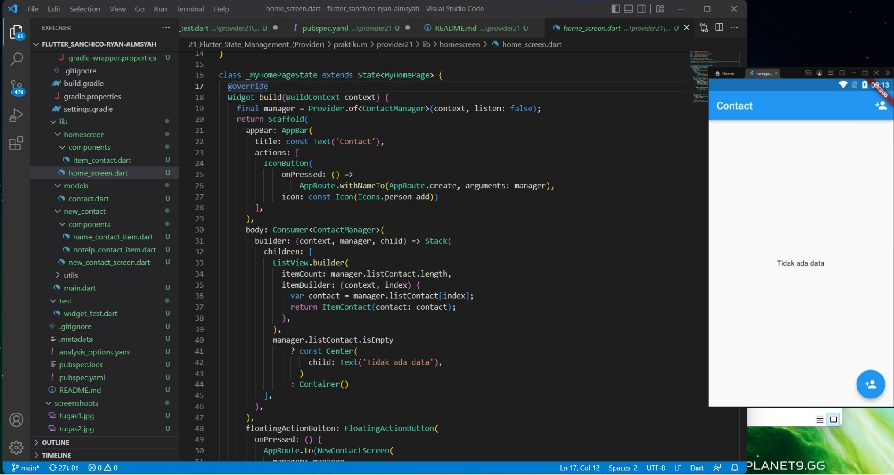
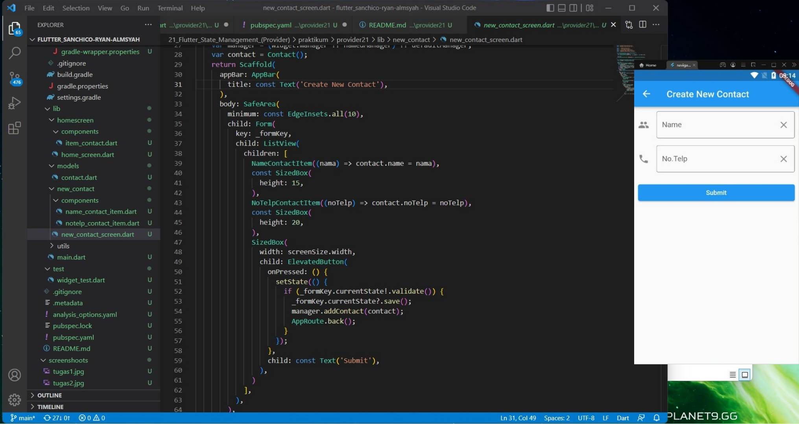
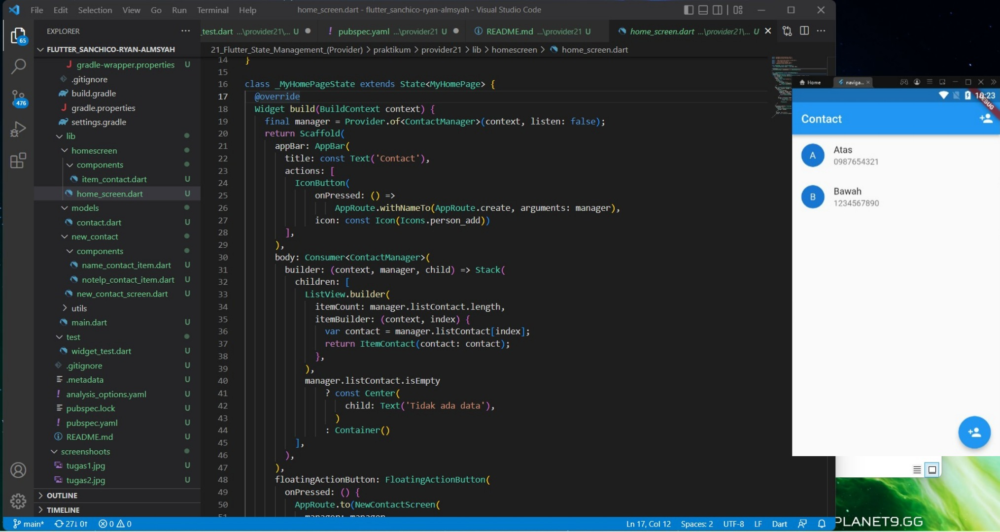

# 20. Flutter State Management (Provider)

```
Name    : Rifqi Mufidianto 
Section : 20. Flutter State Management (Provider)
Date    : Day 31 & 32
``` 

## Summary

### State
- Data yang dapat dibaca saat pembuatan widget
- Dapat berubah saat widget sedang aktif
- Hanya dimiliki oleh **StatefulWidget**
- Global State diperlukan agar antara widget dapat memanfaatkan state yang sama dengan mudah
- Memanfaatkan state
    - Dibuat sebagai property dari class
    - Digunakan pada widget saat build
    - Untuk menggunakan state dapat menggunakan method **setState**

### Global State    
- State biasa yang dapat digunakan pada seluruh widget
- Provider merupakan State management yang perlu di-install agar dapat digunakan
- Instalasi Provider
    - Menambah package [provider](https://pub.dev/packages/provider) pada bagian dependencies dalam file pubspec.yaml
    - Jalankan perintah **flutter pub get**
- Membuat State Provider dapat dilakukan dengan mendefinisikan state dalam bentuk kelas
- Mendaftarkan State Provider dengan cara daftarkan pada **runApp** dengan **MultiProvider**
- Menggunakan State dari provider dengan simpan provider dalam variabel lalu ambil data dari provider melalui getter   

## Task
Berikut hasil yang telah dicoba dan didapatkan pada materi ini. Dengan bantuan library [provider](https://pub.dev/packages/provider) untuk mendapatkan update data.

### Source Code

[Project File](./praktikum/provider20/lib/)

[Folder Home Screen](./praktikum/provider20/lib/homescreen/)

[Folder New Contact](./praktikum/provider20/lib/new_contact/)

[Home Screen](./praktikum/provider20/lib/homescreen/home_screen.dart)

[New Contact](./praktikum/provider20/lib/new_contact/new_contact_screen.dart)

[Contact Manager](./praktikum/provider20/lib/utils/contact_manager.dart)

### Screenshoots







